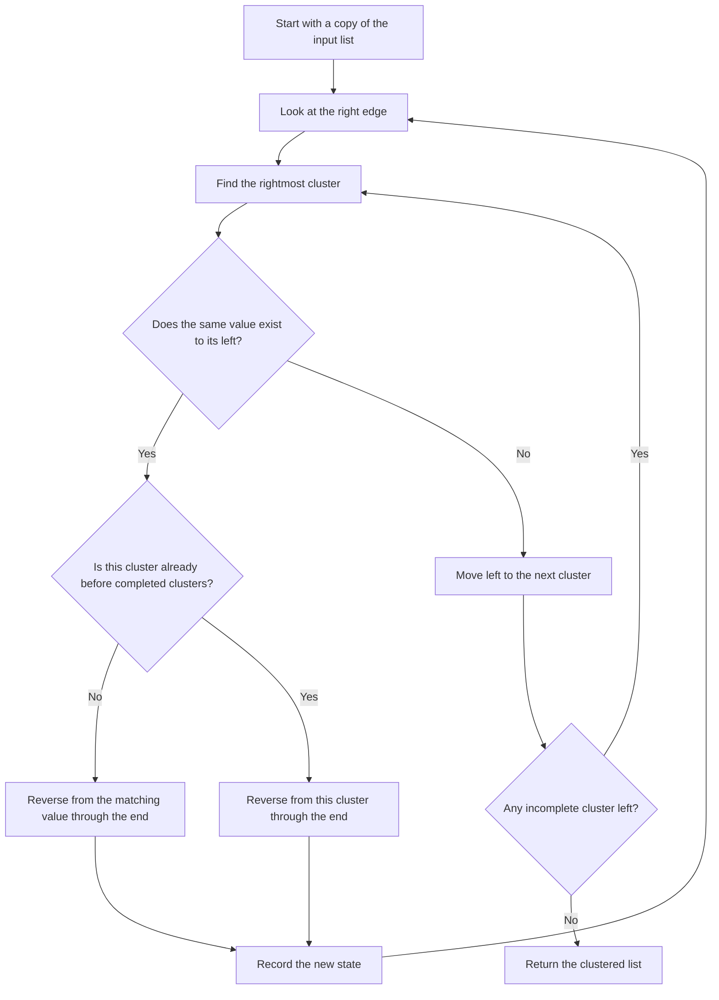

# Cassidy Cluster Experiment

A small experiment companion to Cassidy Williams' blog post,
[**A simple clustering algorithm for lists**](https://cassidoo.co/post/clustering-tiles/).

The original `cassidyCluster` algorithm and reference implementation are by
[**Cassidy Williams**](https://cassidoo.co/) — used here with attribution. This
repo reproduces her function verbatim, generates a step-by-step trace of the
blog example, and adds a run-length-encoded variant to see how much faster
the same heuristic gets when you change the representation but not the moves.

> "It's not the most efficient, but it's very interesting." — Cassidy

## Walkthrough

[](https://www.youtube.com/watch?v=l6bEeP42a2c)

## What's in here

- `src/cassidyCluster.js` — Cassidy's function, verbatim from the post.
- `src/cassidyClusterRuns.js` — Same algorithm, doubly-linked list of runs.
  Each "reverse" is a handful of pointer flips instead of n element swaps.
- `src/countingSortCluster.js` — Counting-sort baseline. Sorts the values
  alphabetically; included only as a lower bound for "how fast could clustering
  go if you didn't care about reversal moves at all?"
- `test/` — `node:test` correctness tests, including a 5000-case fuzz that
  asserts the RLE variant returns bit-identical output to the original.
- `benchmark/cluster.bench.js` — Head-to-head timing across n and alphabet size.
- `tools/generate-trace.js` — Instruments the original function to emit the
  trace table embedded below.

```bash
npm test
npm run benchmark
node tools/generate-trace.js
```

## Decision flow



## How it works, step by step

The trace below is generated by `tools/generate-trace.js` from the blog example:

```text
bgogbrbroorrgbgorrbggo
```

<!-- trace:start -->
| Iteration | Reverse segment | Resulting state |
| ---: | --- | --- |
| 1 | 16-21: `rrbggo` | `bgogbrbroorrgbgooggbrr` |
| 2 | 12-21: `gbgooggbrr` | `bgogbrbroorrrrbggoogbg` |
| 3 | 20-21: `bg` | `bgogbrbroorrrrbggooggb` |
| 4 | 15-21: `ggooggb` | `bgogbrbroorrrrbbggoogg` |
| 5 | 18-21: `oogg` | `bgogbrbroorrrrbbggggoo` |
| 6 | 10-21: `rrrrbbggggoo` | `bgogbrbrooooggggbbrrrr` |
| 7 | 8-21: `ooooggggbbrrrr` | `bgogbrbrrrrrbbggggoooo` |
| 8 | 3-21: `gbrbrrrrrbbggggoooo` | `bgoooooggggbbrrrrrbrbg` |
| 9 | 11-21: `bbrrrrrbrbg` | `bgooooogggggbrbrrrrrbb` |
| 10 | 15-21: `rrrrrbb` | `bgooooogggggbrbbbrrrrr` |
| 11 | 14-21: `bbbrrrrr` | `bgooooogggggbrrrrrrbbb` |
| 12 | 13-21: `rrrrrrbbb` | `bgooooogggggbbbbrrrrrr` |
| 13 | 12-21: `bbbbrrrrrr` | `bgooooogggggrrrrrrbbbb` |
| 14 | 1-21: `gooooogggggrrrrrrbbbb` | `bbbbbrrrrrrgggggooooog` |
| 15 | 16-21: `ooooog` | `bbbbbrrrrrrggggggooooo` |
<!-- trace:end -->

## Benchmark

Run on Node v25 / Apple Silicon. Same exact moves as the array version,
just operating on run nodes instead of element slots.

**Alphabet size 4 (tiles `b g o r`)**

| n | `cassidyCluster` (array) | `cassidyClusterRuns` (RLE) | `countingSortCluster` |
| ---: | ---: | ---: | ---: |
| 1,000 | 4.69 ms | 0.63 ms | 0.20 ms |
| 10,000 | 37.70 ms | 1.10 ms | 0.89 ms |
| 100,000 | 3485.09 ms | 7.91 ms | 5.94 ms |

**Alphabet size 26 (`a-z`)**

| n | `cassidyCluster` (array) | `cassidyClusterRuns` (RLE) | `countingSortCluster` |
| ---: | ---: | ---: | ---: |
| 1,000 | 0.43 ms | 0.13 ms | 0.06 ms |
| 10,000 | 29.29 ms | 1.91 ms | 0.50 ms |
| 100,000 | 2245.89 ms | 23.18 ms | 6.03 ms |

At n=100,000 with alphabet 4, the RLE variant is about **440× faster** than the
array version, and ends up in the same neighborhood as counting sort, which
doesn't have to do any reversals at all. Same algorithm. Same output. The
representation was doing all the work.

> The 5000-case fuzz test in `test/cassidyClusterRuns.test.js` confirms the two
> implementations produce identical output on random inputs across alphabets of
> size 2 through 7.

## A note on credit

Everything interesting about this lives in
[Cassidy's post](https://cassidoo.co/post/clustering-tiles/). This repo is a
personal experiment by [Andrea Griffiths](https://github.com/AndreaGriffiths11),
not a library. If you want to use the algorithm, read the post.

## License

MIT — see [`LICENSE`](./LICENSE).
