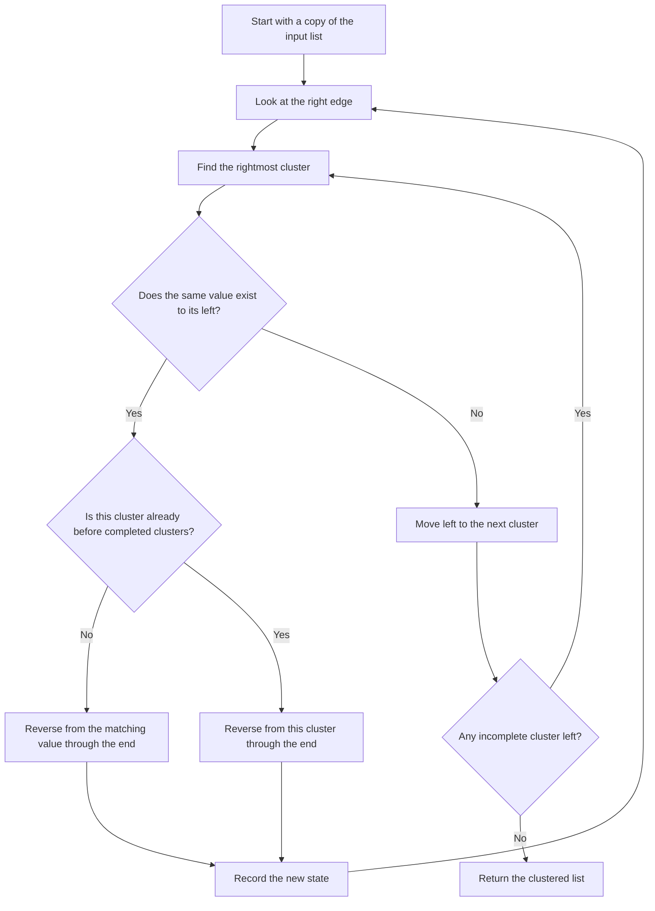

# Cassidy Cluster Experiment

JavaScript implementation of Cassidy Williams' `cassidyCluster` tile clustering algorithm.

## Decision flow



## How it works, step by step

The trace below is generated by `tools/generate-trace.js` from the blog example:

```text
bgogbrbroorrgbgorrbggo
```

<!-- trace:start -->
| Iteration | Reverse segment | Resulting state |
| ---: | --- | --- |
| 1 | 16-21: `rrbggo` | `bgogbrbroorrgbgooggbrr` |
| 2 | 12-21: `gbgooggbrr` | `bgogbrbroorrrrbggoogbg` |
| 3 | 20-21: `bg` | `bgogbrbroorrrrbggooggb` |
| 4 | 15-21: `ggooggb` | `bgogbrbroorrrrbbggoogg` |
| 5 | 18-21: `oogg` | `bgogbrbroorrrrbbggggoo` |
| 6 | 10-21: `rrrrbbggggoo` | `bgogbrbrooooggggbbrrrr` |
| 7 | 8-21: `ooooggggbbrrrr` | `bgogbrbrrrrrbbggggoooo` |
| 8 | 3-21: `gbrbrrrrrbbggggoooo` | `bgoooooggggbbrrrrrbrbg` |
| 9 | 11-21: `bbrrrrrbrbg` | `bgooooogggggbrbrrrrrbb` |
| 10 | 15-21: `rrrrrbb` | `bgooooogggggbrbbbrrrrr` |
| 11 | 14-21: `bbbrrrrr` | `bgooooogggggbrrrrrrbbb` |
| 12 | 13-21: `rrrrrrbbb` | `bgooooogggggbbbbrrrrrr` |
| 13 | 12-21: `bbbbrrrrrr` | `bgooooogggggrrrrrrbbbb` |
| 14 | 1-21: `gooooogggggrrrrrrbbbb` | `bbbbbrrrrrrgggggooooog` |
| 15 | 16-21: `ooooog` | `bbbbbrrrrrrggggggooooo` |
<!-- trace:end -->
